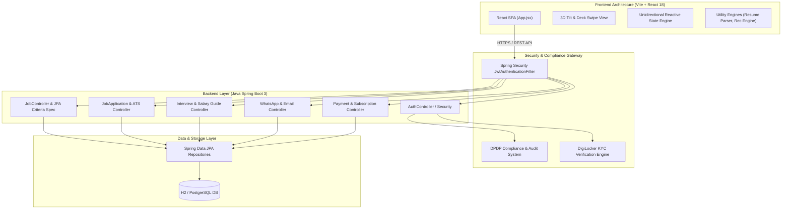
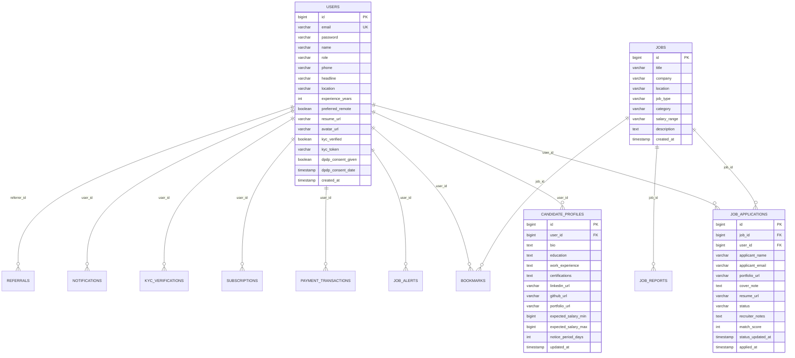

# Master Technical Documentation — WorkVerse (TechJobs)

## 📌 1. Executive Architectural Overview

**WorkVerse (TechJobs)** is an enterprise-grade, full-stack job portal and candidate preparation platform. The application is built on a **Java 17 Spring Boot 3.1.5** RESTful backend paired with a high-performance **React 18.3 (Vite 5.2)** single-page web application.

### Key Capabilities
- **Dynamic Criteria Search**: Spring Data JPA Criteria API query engine (`JobSpecification.java`) enabling real-time filtering across keyword, job type (`FULL_TIME`, `REMOTE`, `CONTRACT`, etc.), location, and functional domain category.
- **3D Tilt & Deck Discovery Engine**: Animated job cards with hardware-accelerated 3D hover physics ($[-1, 1]$ coordinate bounds) and a Tinder-style swipe deck (`DeckView.jsx`).
- **1-Click Quick Apply & ATS Kanban**: Automatic resume parsing (`pdfjs-dist` & `mammoth`) with dynamic skill match calculation and recruiter pipeline status management (`APPLIED`, `SCREENED`, `INTERVIEW_SCHEDULED`, `OFFERED`, `REJECTED`).
- **DigiLocker Identity KYC**: Identity verification workflow supporting Aadhaar, PAN, and GSTIN mock integrations.
- **DPDP Act Data Privacy & Audit Compliance**: Built to comply with India's Digital Personal Data Protection Act, providing user data consent management, JSON data export, and instant right-to-be-forgotten erasure APIs.
- **AI Career Preparation Suite**: AI-driven mock interview simulator, text-to-speech (TTS) audio generator, interactive coding sandbox, and real-time market salary benchmark analytics.
- **Monetization & Omnichannel Alerts**: Razorpay payment order and subscription management (`FREE`, `PRO`, `ENTERPRISE`), in-app notifications, and WhatsApp messaging API integration.

---

## 🏗 2. System Architecture Diagram



---

## 📂 3. Repository Directory Layout

```
.
├── .github/
│   └── workflows/
│       └── ci-cd.yml                          # 4-stage GitHub Actions CI/CD Pipeline
├── backend/
│   ├── Dockerfile                             # Multi-stage Java 17 execution container
│   ├── pom.xml                                # Maven build configuration
│   └── src/
│       ├── main/
│       │   ├── java/com/techjobs/backend/
│       │   │   ├── config/                    # SecurityConfig, WebConfig, DataInitializer
│       │   │   ├── controller/                # 16 REST API Controllers
│       │   │   ├── dto/                       # 23 Data Transfer Objects
│       │   │   ├── entity/                    # 26 Entity & Enum Classes
│       │   │   ├── exception/                 # Global Exception Handler
│       │   │   ├── repository/                # 15 JPA Repositories & Specifications
│       │   │   ├── security/                  # JWT Utils & Custom UserDetailsService
│       │   │   └── service/                   # 17 Service Implementations
│       │   └── resources/
│       │       └── application.properties     # Spring Boot settings
│       └── test/                              # JUnit 5 & MockMvc unit tests
├── frontend/
│   ├── package.json                           # Dependencies & scripts
│   ├── vite.config.js                         # Vite bundle settings
│   ├── index.html                             # Single page HTML entry
│   └── src/
│       ├── App.jsx                            # Main state orchestrator & page view router
│       ├── main.jsx                           # Mount point
│       ├── index.css                          # Custom Tailwind CSS & glassmorphic styles
│       ├── components/                        # 28 React UI Components
│       │   ├── auth/                          # AuthModal, DigilockerKYC, DPDPAudit, Onboarding
│       │   ├── jobs/                          # JobCards, DeckView, ATS, ApplyModal, FilterBar
│       │   ├── prep/                          # AIMockInterview, CodingPlayground, SalaryGuide
│       │   └── seo/                           # Structured JSON-LD JobPosting schemas
│       ├── types/                             # TypeScript interface definitions
│       └── utils/                             # Recommendation engine, theme manager, resume parser
├── .gitignore                                 # Git exclusion definitions
├── CONTRIBUTING.md                            # Contribution & testing workflow
├── DOCUMENTATION.md                           # Master Technical Documentation
├── README.md                                  # Executive README & onboarding guide
└── TECHNICAL.md                               # Platform Architecture Specification
```

---

## 🔌 4. REST API Specification

### Base Endpoints
- **Authentication**: `http://localhost:8080/api/auth`
- **AI Interview Engine**: `http://localhost:8080/api/interview`
- **Core v1 API**: `http://localhost:8080/api/v1`

---

### 1. Authentication Module (`/api/auth`)

| Method | Endpoint | Auth Required | Description |
| :--- | :--- | :---: | :--- |
| `POST` | `/api/auth/register` | No | Register new candidate/employer account |
| `POST` | `/api/auth/login` | No | Authenticate user & return JWT token |
| `GET` | `/api/auth/me` | Yes | Get authenticated user info |
| `POST` | `/api/auth/refresh` | Yes | Refresh active JWT security token |
| `POST` | `/api/auth/verify-otp` | No | Verify 6-digit email signup OTP |

#### `POST /api/auth/register` Example
- **Request**:
  ```json
  {
    "name": "Alex Johnson",
    "email": "alex@example.com",
    "password": "SecurePassword123",
    "role": "ROLE_USER"
  }
  ```
- **Response** (200 OK):
  ```json
  { "message": "User registered successfully!" }
  ```

#### `POST /api/auth/login` Example
- **Request**:
  ```json
  {
    "email": "alex@example.com",
    "password": "SecurePassword123"
  }
  ```
- **Response** (200 OK):
  ```json
  {
    "token": "eyJhbGciOiJIUzI1NiJ9...",
    "id": 1,
    "name": "Alex Johnson",
    "email": "alex@example.com",
    "role": "ROLE_USER"
  }
  ```

---

### 2. Jobs Module (`/api/v1/jobs`)

| Method | Endpoint | Auth Required | Description |
| :--- | :--- | :---: | :--- |
| `GET` | `/api/v1/jobs` | No | Search job listings with keyword, type, location, category filters |
| `GET` | `/api/v1/jobs/{id}` | No | Get single job details by ID |
| `POST` | `/api/v1/jobs` | Employer / Admin | Post a new job opportunity |
| `DELETE` | `/api/v1/jobs/{id}` | Yes | Delete a job posting |
| `POST` | `/api/v1/jobs/{id}/apply` | Candidate | Submit job application form |
| `GET` | `/api/v1/jobs/{id}/applications` | Employer | List applications received for a specific job |
| `POST` | `/api/v1/jobs/recommendations` | No | Generate profile-based job recommendations & skill gap analysis |

#### `GET /api/v1/jobs` Query Parameters
- `keyword`: Fuzzy text match on title, description, or tech stack
- `jobType`: `FULL_TIME`, `PART_TIME`, `CONTRACT`, `REMOTE`, `HYBRID`, `INTERNSHIP`
- `location`: Location string match (e.g. "Bengaluru")
- `category`: Functional domain (e.g. "Engineering", "Product & Data")

---

### 3. Quick Apply Module (`/api/v1/jobs/{jobId}/quick-apply`)

| Method | Endpoint | Auth Required | Description |
| :--- | :--- | :---: | :--- |
| `POST` | `/api/v1/jobs/{jobId}/quick-apply` | Candidate | 1-Click job application submission |

- **Request Body** (Optional): `{ "customCoverNote": "Interested in joining the team." }`
- **Response** (201 Created):
  ```json
  {
    "applicationId": 15,
    "jobId": 1,
    "jobTitle": "Senior Frontend Engineer",
    "companyName": "Razorpay",
    "applicantName": "Alex Johnson",
    "applicantEmail": "alex@example.com",
    "resumeUrl": "https://workverse.com/resumes/alex.pdf",
    "matchScore": 95,
    "status": "APPLIED",
    "appliedAt": "2026-07-27T11:00:00"
  }
  ```

---

### 4. Candidate Profile & DPDP Privacy (`/api/v1/profile`)

| Method | Endpoint | Auth Required | Description |
| :--- | :--- | :---: | :--- |
| `GET` | `/api/v1/profile` | Yes | Get full user and candidate profile |
| `PUT` | `/api/v1/profile` | Yes | Update profile bio, skills, education, salary expectation |
| `POST` | `/api/v1/profile/dpdp-consent` | Yes | Record DPDP Act consent timestamp |
| `GET` | `/api/v1/profile/data-export` | Yes | Download personal data export (`workverse-data-export.json`) |
| `DELETE` | `/api/v1/profile/data` | Yes | Erase all personal account data per DPDP Act |

---

### 5. Identity KYC Module (`/api/v1/kyc`)

| Method | Endpoint | Auth Required | Description |
| :--- | :--- | :---: | :--- |
| `POST` | `/api/v1/kyc/initiate` | Yes | Start Aadhaar/PAN identity verification |
| `POST` | `/api/v1/kyc/verify-otp` | Yes | Verify Aadhaar OTP code |
| `POST` | `/api/v1/kyc/verify-pan` | Yes | Validate PAN card number |
| `POST` | `/api/v1/kyc/verify-gstin` | Yes | Validate employer GSTIN registration |
| `GET` | `/api/v1/kyc/status` | Yes | Get verification summary and boolean status |

---

### 6. AI Interview Engine (`/api/interview`)

| Method | Endpoint | Auth Required | Description |
| :--- | :--- | :---: | :--- |
| `POST` | `/api/interview/generate` | No | Generate custom technical interview questions |
| `POST` | `/api/interview/tts` | No | Generate TTS audio stream for questions |

#### `POST /api/interview/generate` Example
- **Request**:
  ```json
  {
    "userId": "user-1",
    "jobDescription": "Full Stack Developer with Spring Boot and React...",
    "jobTitle": "Full Stack Developer",
    "resumeText": "5 years experience building Web applications...",
    "mode": "tech_resume",
    "questionCount": 3
  }
  ```
- **Response** (200 OK):
  ```json
  {
    "sessionId": "session-12345",
    "jobTitle": "Full Stack Developer",
    "mode": "tech_resume",
    "totalQuestions": 3,
    "remainingDailyQuota": 9,
    "questions": [
      {
        "id": 1,
        "question": "How do you optimize state re-renders in a large React application?",
        "topic": "Frontend Architecture",
        "difficulty": "Medium"
      }
    ]
  }
  ```

---

### 7. Payments & Subscriptions (`/api/v1/payments`)

| Method | Endpoint | Auth Required | Description |
| :--- | :--- | :---: | :--- |
| `POST` | `/api/v1/payments/create-order` | Yes | Create Razorpay subscription order |
| `POST` | `/api/v1/payments/verify` | Yes | Verify Razorpay payment signature & upgrade plan |
| `GET` | `/api/v1/payments/subscription` | Yes | Get active subscription details |
| `GET` | `/api/v1/payments/invoices` | Yes | Get billing invoice history |
| `GET` | `/api/v1/payments/invoices/{id}` | Yes | Download single GST billing invoice |

---

### 8. Auxiliary Services (Notifications, Bookmarks, Alerts, Referrals, Admin)

- **Notifications (`/api/v1/notifications`)**:
  - `GET /api/v1/notifications` — Fetch user in-app notifications
  - `GET /api/v1/notifications/unread-count` — Unread notification counter
  - `PUT /api/v1/notifications/{id}/read` — Mark notification read
  - `PUT /api/v1/notifications/read-all` — Mark all read
- **Bookmarks (`/api/v1`)**:
  - `POST /api/v1/jobs/{jobId}/bookmark` — Toggle bookmark status
  - `GET /api/v1/bookmarks` — List bookmarked jobs
  - `DELETE /api/v1/jobs/{jobId}/bookmark` — Remove bookmark
- **Job Alerts (`/api/v1/alerts`)**:
  - `POST /api/v1/alerts` — Save alert filter criteria
  - `GET /api/v1/alerts` — Fetch active candidate job alerts
  - `PUT /api/v1/alerts/{id}` — Edit job alert
  - `DELETE /api/v1/alerts/{id}` — Delete job alert
- **Referrals (`/api/v1/referrals`)**:
  - `POST /api/v1/referrals` — Create referral invite code
  - `GET /api/v1/referrals` — List sent candidate referrals
  - `GET /api/v1/referrals/validate/{code}` — Validate referral code
- **WhatsApp Alerts (`/api/v1/notifications/whatsapp`)**:
  - `POST /api/v1/notifications/whatsapp/test-interview-alert` — Send WhatsApp message alert
- **Admin Moderation (`/api/v1/admin`)**:
  - `GET /api/v1/admin/dashboard` — Platform overview metrics
  - `GET /api/v1/admin/reports` — List flagged job reports
  - `PUT /api/v1/admin/reports/{id}/review` — Review job report status
  - `PUT /api/v1/admin/users/{id}/role` — Update user security role
  - `GET /api/v1/admin/kyc-audits` — List identity verification audit logs

---

## 📊 5. Database Schema & Entity Relationships

The backend uses 14 JPA Entities mapped to relational database tables:



---

## ⚙️ 6. Environment Variables & Properties

Key configurations defined in `backend/src/main/resources/application.properties`:

```properties
# Web Server Configuration
server.port=8080

# In-Memory H2 Database Settings
spring.datasource.url=jdbc:h2:mem:techjobsdb;DB_CLOSE_DELAY=-1;DB_CLOSE_ON_EXIT=FALSE
spring.datasource.driverClassName=org.h2.Driver
spring.datasource.username=sa
spring.datasource.password=

# H2 Console Settings
spring.h2.console.enabled=true
spring.h2.console.path=/h2-console

# Hibernate JPA Settings
spring.jpa.database-platform=org.hibernate.dialect.H2Dialect
spring.jpa.hibernate.ddl-auto=update
spring.jpa.show-sql=true

# Security & JWT Configuration
jwt.secret=WorkVerseSuperSecureSecretKeyWithAtLeast256BitsLengthBecauseWhyNot2026!
jwt.expirationMs=86400000

# Mock Integration Config Keys
razorpay.key_id=rzp_test_workverse_mock_key
razorpay.key_secret=mock_secret_workverse_2026
digilocker.client_id=mock_digilocker_client_id
```

---

## 🔒 7. Security Architecture

1. **JWT Authentication Gateway**:
   - `JwtAuthenticationFilter` intercepts incoming HTTP requests.
   - Extracts Bearer token from `Authorization` header.
   - Validates HMAC-SHA256 signature via `JwtUtils`.
   - Populates `SecurityContextHolder` with `CustomUserDetails`.

2. **Role-Based Access Control (RBAC)**:
   - `ROLE_USER` / `ROLE_CANDIDATE`: Default job seeker role.
   - `ROLE_EMPLOYER`: Permitted to post jobs and view applicant pipelines.
   - `ROLE_ADMIN`: Access to admin metrics, user role mutation, and KYC audit logs.

---

## 🤖 8. CI/CD Pipeline Specification

Configured via [.github/workflows/ci-cd.yml](file:///d:/GLOBALCO%20ASSESSMENT%20FOR%20SOFTWARE%20ENGINEER/.github/workflows/ci-cd.yml):

1. **`backend-ci`**: JDK 17 setup, Maven dependency caching, unit test execution, JAR packaging, Docker image build, and Trivy security scanning.
2. **`frontend-ci`**: Node.js 18 setup, NPM caching, Vite production asset bundling, and Playwright E2E browser tests.
3. **`ai-quality-gate`**: Quality audit and security policy compliance verification.
4. **`deploy`**: Automatic deployment of production assets to CDN and cloud platform upon push to `main` branch.

---

## 🤝 9. Contribution Guidelines

Refer to [CONTRIBUTING.md](file:///d:/GLOBALCO%20ASSESSMENT%20FOR%20SOFTWARE%20ENGINEER/CONTRIBUTING.md) for branch naming conventions, commit syntax, JUnit backend execution (`mvn clean test`), and Playwright frontend E2E execution (`npx playwright test`).
