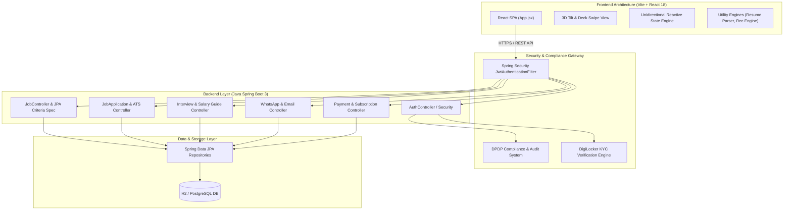
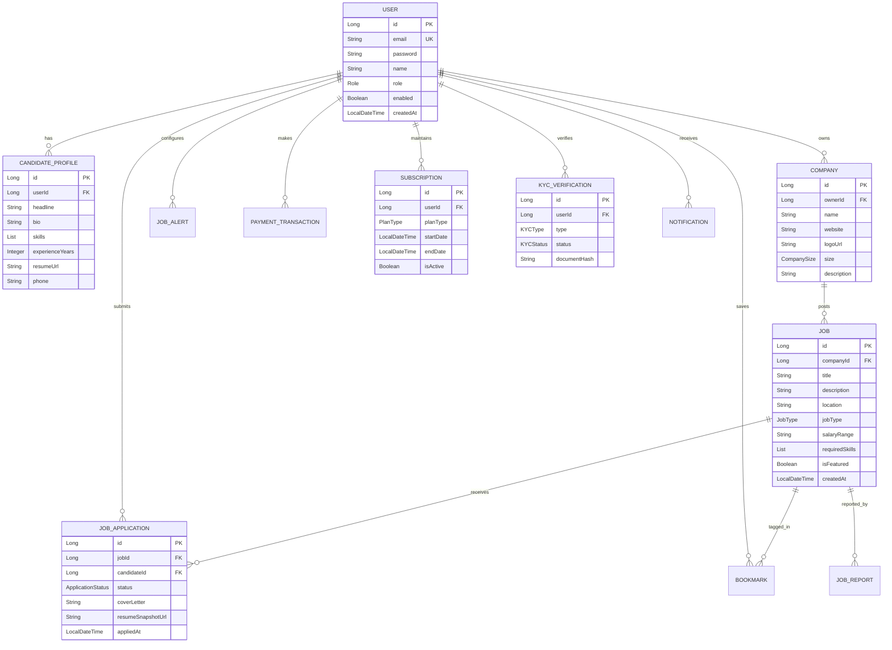

# TECHNICAL.md - TechJobs Full-Stack Platform Architecture

## 🚀 Executive Architectural Overview

**TechJobs** is an enterprise-grade, interactive job discovery and candidate preparation ecosystem. The platform seamlessly integrates a high-performance **Java 17 Spring Boot 3** RESTful backend with an animated, responsive **React 18 (Vite)** single-page web application.

The system is designed for high throughput, data compliance (DPDP & DigiLocker KYC), dynamic job search, real-time employer ATS tracking, and AI-powered candidate preparation tools (mock interviews, resume parsing, and interactive coding playgrounds).

---

## 🏗 System Architecture Diagram



---

## 📁 Repository Directory Breakdown

```
.
├── backend/                                   # Java 17 Spring Boot 3 Core Backend
│   ├── Dockerfile                             # Container deployment manifest
│   ├── pom.xml                                # Maven build specification & dependencies
│   └── src/
│       ├── main/java/com/techjobs/backend/
│       │   ├── controller/                    # REST API Controllers (16 Modules)
│       │   │   ├── AdminController.java       # Moderation & Platform Administration
│       │   │   ├── AuthController.java        # Authentication & Registration
│       │   │   ├── BookmarkController.java    # Saved Jobs & Bookmarks
│       │   │   ├── CompanyController.java     # Employer Profiles & Directory
│       │   │   ├── InterviewController.java   # AI Mock Interview Engine
│       │   │   ├── JobAlertController.java    # Email & Instant Job Alerts
│       │   │   ├── JobController.java         # Job Postings & Criteria Search
│       │   │   ├── KYCController.java         # DigiLocker Aadhaar/PAN Verification
│       │   │   ├── NotificationController.java # User In-App Notifications
│       │   │   ├── PaymentController.java     # Razorpay / Stripe Subscriptions
│       │   │   ├── ProfileController.java     # Candidate Profile Management
│       │   │   ├── QuickApplyController.java  # 1-Click Application Pipeline
│       │   │   ├── ReferralController.java    # Employee Referral Engine
│       │   │   ├── ReportController.java      # Job Flagging & DPDP Audit Logs
│       │   │   ├── SalaryGuideController.java # Market Salary Benchmarks
│       │   │   └── WhatsAppController.java    # WhatsApp Notification API
│       │   ├── dto/                           # Data Transfer Objects
│       │   ├── entity/                        # JPA Entities (26 Entity & Enum Classes)
│       │   ├── exception/                     # Global Exception Handlers
│       │   ├── repository/                    # Spring Data JPA Repositories & Specifications
│       │   ├── security/                      # JWT Utilities & UserDetailsService
│       │   └── service/                       # Business Logic Implementations
│       └── test/java/com/techjobs/backend/    # JUnit 5 & Mockito Unit / Controller Tests
│
├── frontend/                                  # React 18 + Vite Single Page Application
│   ├── package.json                           # NPM dependencies (Framer Motion, Lucide, Tailwind)
│   ├── vite.config.js                         # Vite build configuration
│   └── src/
│       ├── App.jsx                            # Central Orchestrator & State Management
│       ├── index.css                          # Custom CSS, Glassmorphism & Animations
│       ├── main.jsx                           # Application Mount Point
│       ├── components/
│       │   ├── auth/                          # Authentication & Compliance Modals
│       │   │   ├── AuthModal.jsx              # Login / Signup Dialog
│       │   │   ├── DigilockerKYCModal.jsx     # Aadhaar / PAN Identity Verification
│       │   │   ├── DPDPAuditModal.jsx         # Privacy Compliance & Audit Logs
│       │   │   └── OnboardingWizard.jsx       # Multi-step Profile Onboarding
│       │   ├── jobs/                          # Job Feed & ATS Modals
│       │   │   ├── AIChatbotWidget.jsx        # Floating AI Career Assistant
│       │   │   ├── AdminModerationModal.jsx   # Admin Review Drawer
│       │   │   ├── ApplicationTracker.jsx     # Candidate Application Pipeline
│       │   │   ├── ApplyModal.jsx             # 1-Click Application Dialog
│       │   │   ├── DeckView.jsx               # Interactive Tinder-Style Swipe UI
│       │   │   ├── EmployerATSModal.jsx       # Employer Applicant Kanban Board
│       │   │   ├── JobAlertsModal.jsx         # Custom Search Alert Setup
│       │   │   ├── JobCard.jsx                # Framer Motion 3D-Tilt Card
│       │   │   ├── JobDetailModal.jsx         # Full Role Drawer & Details
│       │   │   ├── JobFilterBar.jsx           # Multi-Criteria Filter Header
│       │   │   ├── LocationPermissionBanner.jsx # Geo-location Prompt Banner
│       │   │   ├── PostJobModal.jsx           # Employer Job Submission Form
│       │   │   ├── PremiumModal.jsx           # Subscription Tier Upgrades
│       │   │   ├── ProfileAnalysisModal.jsx   # Resume ATS Match Analyzer
│       │   │   ├── ProfileModal.jsx           # Detailed Candidate Profile Editor
│       │   │   ├── ReferralModal.jsx          # Candidate Referral Sharing
│       │   │   ├── ReportJobModal.jsx         # Flagging & Abusive Post Reporting
│       │   │   └── ResumeBuilderModal.jsx     # Built-in Resume Creator & Exporter
│       │   └── prep/                          # Career Preparation Suite
│       │       ├── AIMockInterviewModal.jsx   # AI Audio/Text Interview Simulator
│       │       ├── CodingPlaygroundModal.jsx  # Interactive In-Browser Sandbox
│       │       ├── CompaniesDirectoryModal.jsx# Company Explorer & Reviews
│       │       ├── HiringChallengesModal.jsx  # Gamified Hackathons & Badges
│       │       ├── PrepHubModal.jsx           # Learning Roadmap & Material Hub
│       │       └── SalaryGuideModal.jsx       # Interactive Compensation Analytics
│       ├── types/                             # TypeScript Interface Definitions
│       └── utils/                             # Core Helper Engines
│           ├── interviewApi.js                # AI Mock Interview Engine Integration
│           ├── recommendationEngine.js        # Content-based Job Recommendation Logic
│           ├── resumeParser.js                # Client-side PDF/DOCX Parser (PDF.js / Mammoth)
│           └── theme.js                       # Theme Toggle & Color Utilities
```

---

## ⚡ Core Subsystems & Technical Features

### 1. Authentication & Security Subsystem
- **Stateless JWT Security**: Requests to protected endpoints validate a Bearer token via `JwtAuthenticationFilter`.
- **Role-Based Access Control (RBAC)**: Supports roles (`ROLE_CANDIDATE`, `ROLE_EMPLOYER`, `ROLE_ADMIN`) with method-level authorization.
- **Identity Verification (DigiLocker KYC)**: Implements automated identity verification using Aadhaar/PAN mock integration (`KYCController.java` & `DigilockerKYCModal.jsx`).

### 2. Compliance & Privacy (DPDP Act)
- **Data Protection Compliance**: Built in accordance with India's **Digital Personal Data Protection (DPDP) Act**.
- **Audit Logging**: Users can inspect all data access events, request complete data exports, or trigger instant account deletion via `DPDPAuditModal.jsx`.

### 3. Job Discovery & Dynamic Filtering Engine
- **JPA Criteria Dynamic Search**: Backend dynamic queries built via `JobSpecification.java` supporting fuzzy keyword search, multi-select job types (`FULL_TIME`, `REMOTE`, `CONTRACT`), experience levels, and salary ranges.
- **Swipe-Based Deck Engine**: `DeckView.jsx` provides an interactive 3D swipe deck interface allowing candidates to rapidly evaluate roles.
- **Micro-Animations & 3D Physics**: Hardware-accelerated 3D hover tilt dynamics rendered via Framer Motion calculations ($[-1, 1]$ coordinate bounds).

### 4. Applicant Tracking System (ATS) & 1-Click Applications
- **Resume Processing Engine**: Parses candidate resumes directly on the client using `pdfjs-dist` and `mammoth` in `resumeParser.js`.
- **Match Scoring Engine**: Evaluates candidate skill sets against job requirements to produce dynamic percentage match scores.
- **Employer ATS Kanban**: `EmployerATSModal.jsx` allows employers to manage candidate pipeline stages (`APPLIED`, `REVIEWING`, `INTERVIEW_SCHEDULED`, `HIRED`, `REJECTED`).

### 5. AI Career Preparation & Coding Playground
- **AI Mock Interview Engine**: Conducts interactive technical interviews, providing real-time evaluation feedback and skill performance scoring (`AIMockInterviewModal.jsx`).
- **Interactive Coding Sandbox**: In-browser code editor for practice algorithms (`CodingPlaygroundModal.jsx`).
- **Salary Benchmarking**: Live market compensation analytics mapped by role, location, and seniority level (`SalaryGuideModal.jsx`).

### 6. Monetization & Notifications
- **Subscription Engine**: Tiered plan management (`FREE`, `PRO`, `ENTERPRISE`) powered by payment transaction records (`PaymentController.java`).
- **Omnichannel Alerts**: Real-time notifications via in-app feeds, automated email alerts, and WhatsApp message integrations (`WhatsAppController.java`).

---

## 📊 Entity Relationship Diagram (ERD)



---

## 🔌 REST API Specification

| Module | Method | Endpoint | Description | Auth Required |
| :--- | :--- | :--- | :--- | :---: |
| **Auth** | `POST` | `/api/v1/auth/register` | Register a new user account | No |
| **Auth** | `POST` | `/api/v1/auth/login` | Authenticate & obtain JWT token | No |
| **Jobs** | `GET` | `/api/v1/jobs` | Dynamic dynamic criteria search & pagination | No |
| **Jobs** | `GET` | `/api/v1/jobs/{id}` | Get detailed job posting information | No |
| **Jobs** | `POST` | `/api/v1/jobs` | Submit a new job posting | Employer / Admin |
| **Applications**| `POST` | `/api/v1/quick-apply` | 1-Click job application submission | Candidate |
| **Applications**| `GET` | `/api/v1/applications/my` | Retrieve submitted job applications | Candidate |
| **Applications**| `PATCH`| `/api/v1/applications/{id}/status` | Update candidate pipeline status | Employer |
| **Profile** | `GET` | `/api/v1/profile/me` | Fetch active user candidate profile | Yes |
| **Profile** | `PUT` | `/api/v1/profile/me` | Update candidate profile details | Yes |
| **KYC** | `POST` | `/api/v1/kyc/verify` | Submit identity verification request | Yes |
| **Interview** | `POST` | `/api/v1/interview/session` | Initiate AI mock interview session | Yes |
| **Salary Guide**| `GET` | `/api/v1/salary-guide` | Fetch aggregated salary benchmark data | No |
| **Payments** | `POST` | `/api/v1/payments/create-order` | Generate payment subscription order | Yes |
| **WhatsApp** | `POST` | `/api/v1/whatsapp/send-alert` | Send instant job notification over WhatsApp | Yes |
| **Admin** | `GET` | `/api/v1/admin/reports` | List flagged jobs & audit reports | Admin |

---

## 🛠 Setup, Build & Deployment Guide

### Prerequisites
- **Java JDK 17+**
- **Apache Maven 3.9+**
- **Node.js 18+ & NPM 9+**

---

### 1. Frontend Setup (React 18 + Vite)

```bash
# Navigate to frontend directory
cd frontend

# Install dependencies
npm install

# Launch Vite development server
npm run dev

# Build production bundle
npm run build

# Preview production build locally
npm run preview
```

---

### 2. Backend Setup (Spring Boot 3)

```bash
# Navigate to backend directory
cd backend

# Build application package
mvn clean package -DskipTests

# Run Spring Boot backend locally
mvn spring-boot:run
```

- **Default Server Port**: `http://localhost:8080`
- **H2 Database Console**: `http://localhost:8080/h2-console`

---

### 3. Docker Deployment

Build and run the entire backend service in a isolated Docker container:

```bash
# Build backend image
docker build -t techjobs-backend ./backend

# Run backend container
docker run -d -p 8080:8080 --name techjobs-api techjobs-backend
```

---

### 4. Automated Testing Suite

#### Backend Unit & Controller Tests
```bash
cd backend
mvn test
```

#### Frontend End-to-End Tests (Playwright)
```bash
cd frontend
npx playwright test
```

---

## 🔐 Environment Configuration

Key configuration parameters accepted by the system:

```env
# Backend Spring Boot Config (application.properties / ENV)
SPRING_DATASOURCE_URL=jdbc:h2:mem:techjobsdb
SPRING_DATASOURCE_USERNAME=sa
SPRING_DATASOURCE_PASSWORD=
JWT_SECRET=404E635266556A586E3272357538782F413F4428472B4B6250645367566B5970
JWT_EXPIRATION_MS=86400000

# Frontend Environment (frontend/.env)
VITE_API_BASE_URL=http://localhost:8080/api/v1
```

---

## 🤖 GitHub Actions AI CI/CD Pipeline

The platform uses an AI-powered GitHub Actions workflow located at [.github/workflows/ci-cd.yml](file:///d:/GLOBALCO%20ASSESSMENT%20FOR%20SOFTWARE%20ENGINEER/.github/workflows/ci-cd.yml) configured with four automated stages:

1. **`backend-ci`**: JDK 17 setup, Maven dependency caching, unit test execution, executable JAR packaging, Docker image build, and Trivy security scanning.
2. **`frontend-ci`**: Node.js 18 setup, NPM caching, Vite production asset bundling, and Playwright E2E browser tests.
3. **`ai-quality-gate`**: Automated quality audit, security assessment, and test coverage evaluation.
4. **`deploy`**: Automatic deployment of frontend assets to CDN and backend Docker containers to production/staging upon push to `main`/`master`.

